# Creator City | 创作者之城

> AI 创作者的像素城市、个人展厅与交流社区 —— 把每个人的真实素材，变成一部可以逛、可以辩、可以演示的动态主页。

**在线演示**：https://crecity.farly.me

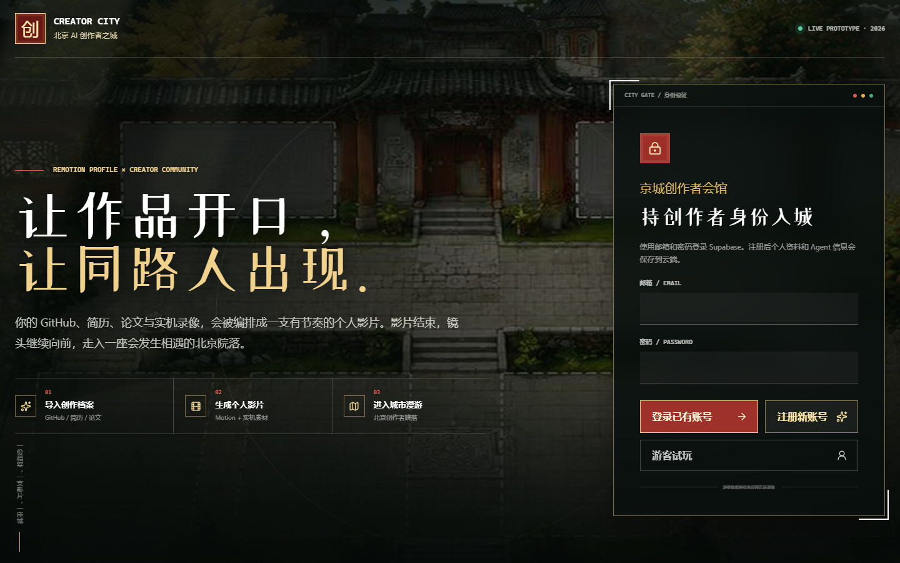

---

## 项目简介

Creator City 是一个面向 AI 创作者的数字城市社区。它把一个普通的个人主页升级为「一部动态影片 + 一座可进入的城市 + 一场可参与的辩论」：

- **个人影片**：导入 GitHub、简历、视频、图片、PDF 等真实素材，系统自动编排成带 Remotion 场景的个人介绍片，可现场渲染 MP4。
- **像素城市**：北京院落风格的像素城市，WASD 行走、NPC 档案、Agent 相遇交谈，城市的每栋建筑都对应一个真实功能模块。
- **Agent 辩论**：微信风格的 Agent 群聊，内置 30+ 预制人物（张雪峰、张一鸣、Musk、Claude…），也支持个人 Agent 通过问卷画像进入群聊辩论。
- **黑客松会场**：比赛公告、AI 组队、悬赏验收、创作者会面，一站式的创作者协作场景。
- **模型竞技场**：基于 OpenRouter 实时目录的九维模型榜单（综合 / 编程 / 推理 / Agent / 多模态 / 价格 / 速度 / 上下文）。

## 功能模块

### 1. 像素城市（主城广场）

北京院落底图上的可交互城市：九座独立建筑、可行走角色、独立 NPC 档案、茶务 NPC、双 Agent 相遇交谈循环。在城中走到对应建筑按下 E，即可进入对应功能模块。

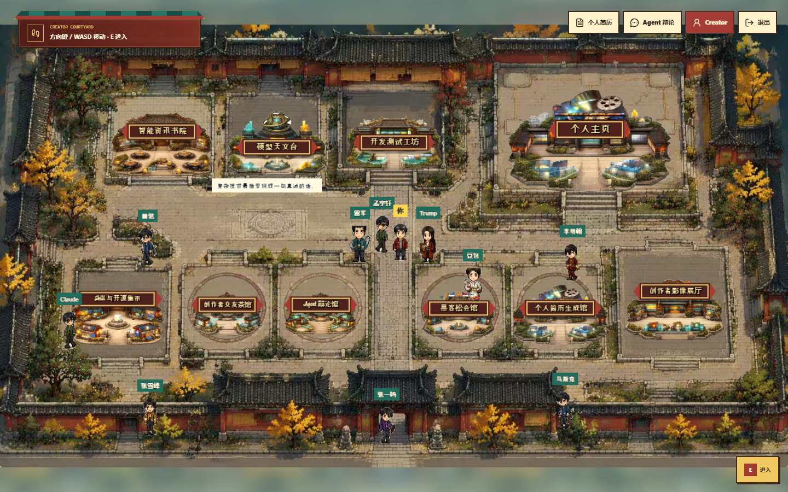

### 2. 个人故事引擎（档案工作台）

从任意创作者素材出发：GitHub 主页导入、简历（PDF/DOCX/TXT/Markdown）文字提取、视频 / 图片 / 文档上传。系统读取媒体元数据并抽取代表画面，用户的评论决定素材对应哪段经历，最终编排成六段叙事。


四种视觉世界（京城夜幕 / 纸上档案 / 信号实验室 / 先锋展厅）会直接改变 Remotion 成片的底色、网格、强调色与转场。


### 3. Remotion 导演台（影片渲染）

实时 Remotion 预览：左侧动态解说、右侧实机 / 路演 / 图片 / 文档同屏播放，重点视频片段可全屏。支持 1280×720 H.264 MP4 现场渲染，总时长由故事板动态计算。

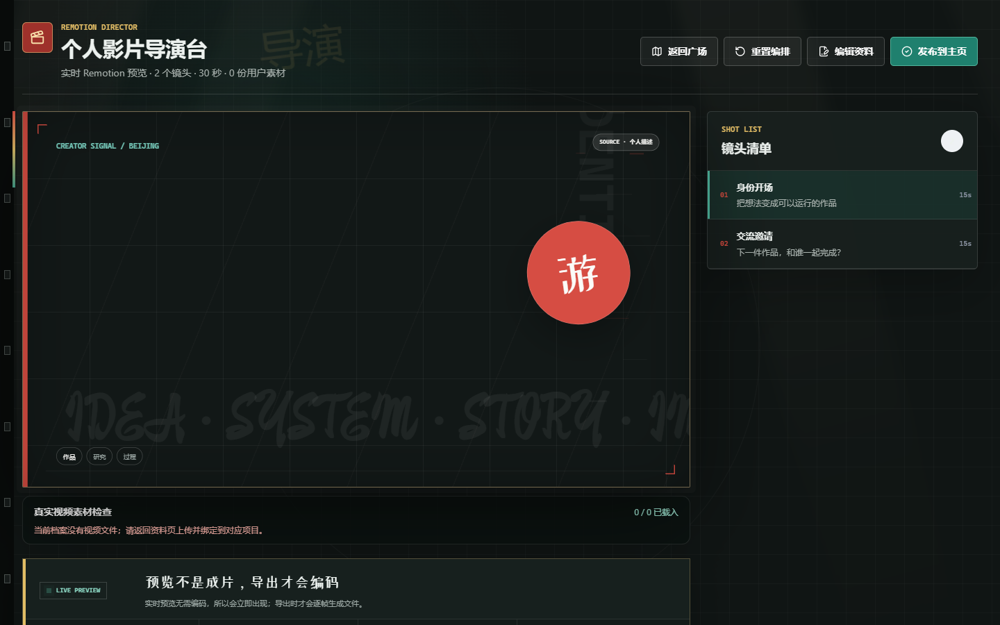

### 4. Agent 辩论（群聊）

微信风格 Agent 群聊：内置 Musk、Trump、Claude、张雪峰、雷军、张一鸣、Sam Altman、Einstein 等 30+ 人物；个人 Agent 通过问卷生成画像后进入群聊。保留原始辩论核心（调度、验证、重试、裁判），支持个人档案适配层。

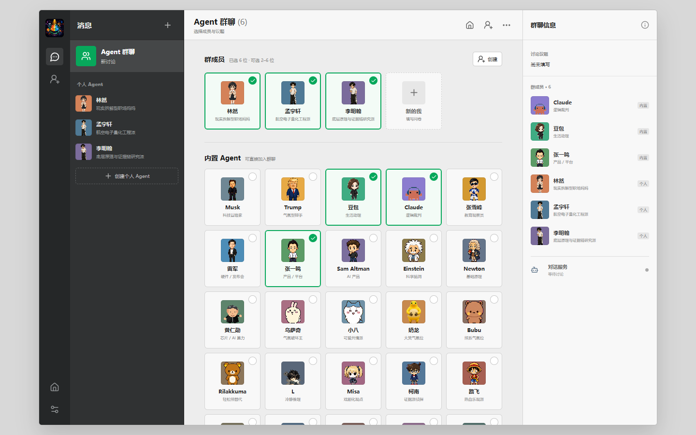

### 5. 黑客松会场与组队协作

比赛公告（Agent 城市挑战赛、开源创作周、AI for Beijing）、AI 组队按空缺席位匹配、Demo 展示博物馆；协作区提供开发测试悬赏桌（复现、验收、积分与红包）和创作者会面桌（公开作品、互补能力、Agent 匹配）。

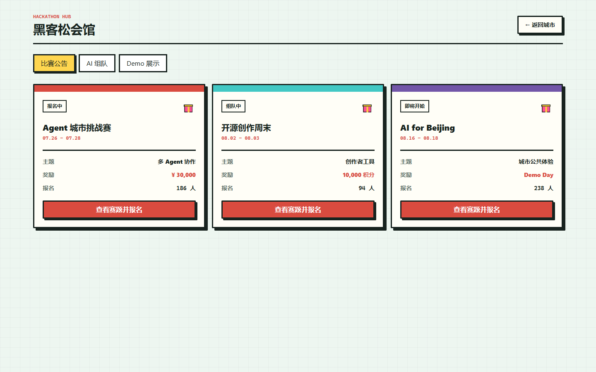

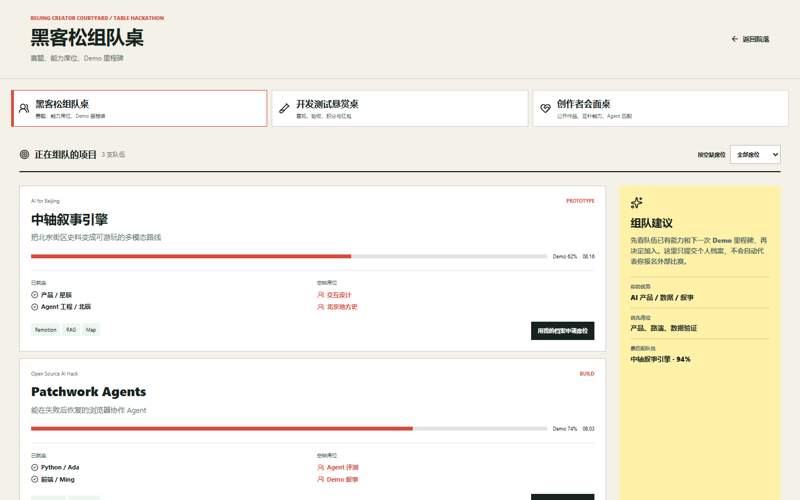

### 6. 模型竞技场

不是一张总榜，而是九种选择模型的方式：综合榜、编程榜、推理榜、Agent 榜、多模态榜、输入价格榜、输出价格榜、速度榜、上下文榜。价格与上下文来自 OpenRouter 公开实时目录。

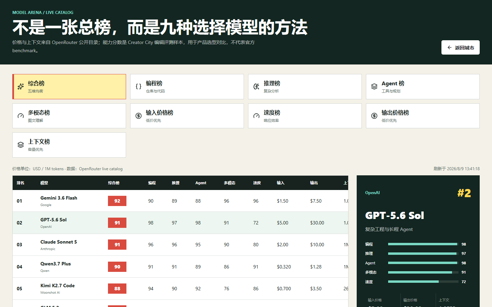

### 7. Skill 花园

每一株植物对应一个真实工作流、来源仓库和安装入口（Remotion Best Practices、Browser Use、OpenAI Codex 等）。

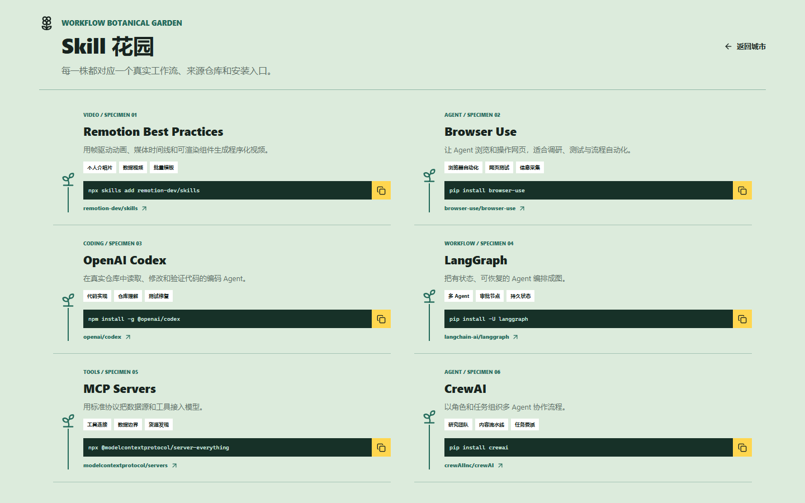

### 8. AI 情报台

聚合 OpenAI RSS、GitHub Blog RSS 与 GitHub Search API 的实时信号流，按 AI / Coding / Agent / GitHub 分类，每条信号可追溯来源。

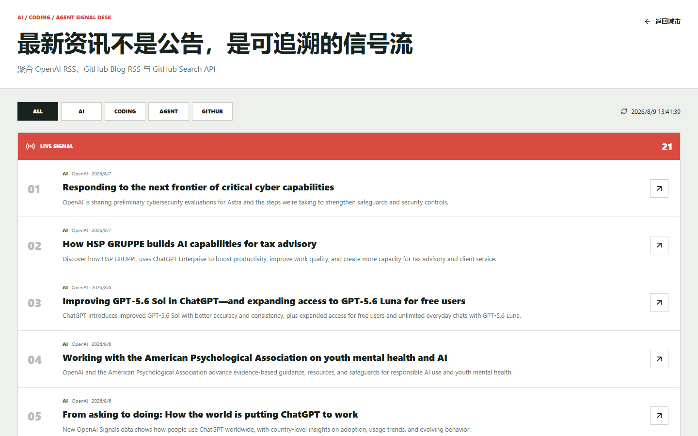

### 9. AI 导师

Growth system：按个人档案评估当前能力（Multi-Agent Systems、Vector Databases、AI Product Strategy…）并生成成长路线图。

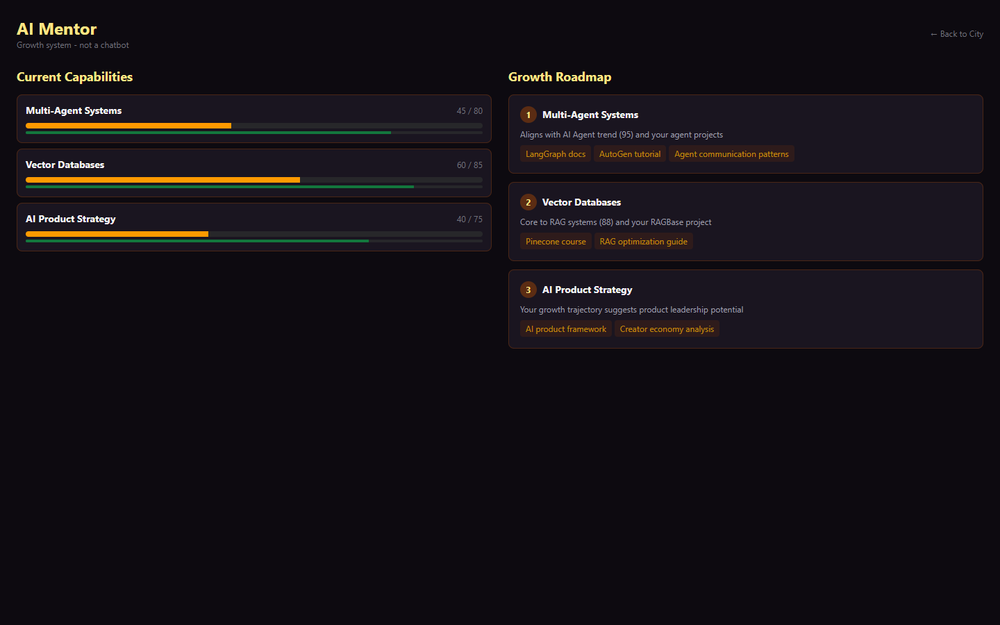

### 10. 创作者展廊

动态主页影片与结构化项目档案并列展示，支持从公开 GitHub 拉取创作者案例（作品 / 研究 / 过程三标签切换）。

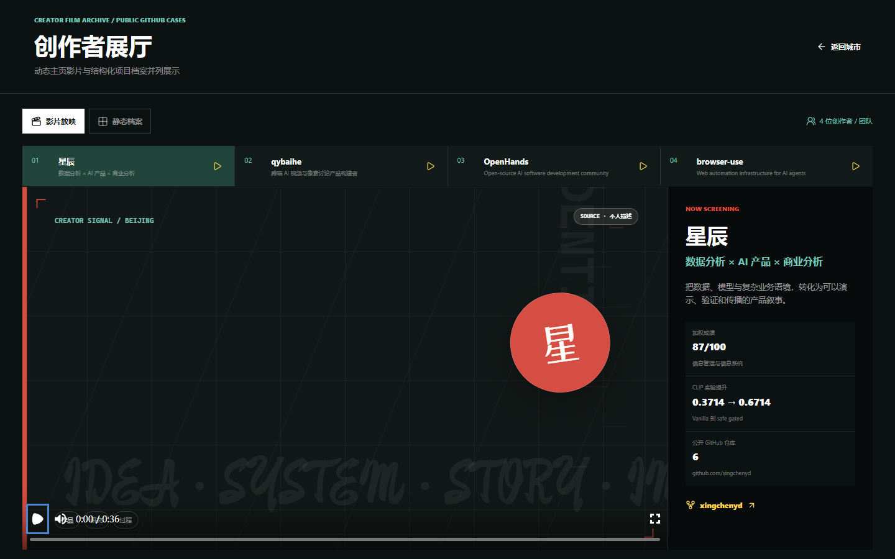

---

## 技术架构

```text
apps/city           Next.js 16 主应用（创作者之城）
  ├── src/app/*     页面路由：city / profile / video / projects / collaboration / leaderboard / skills / intelligence / lab / creator
  ├── src/remotion   动态影片场景（身份、轨迹、结果、项目、论文、技能、结尾）
  ├── src/city       像素城市场景与 NPC（Phaser）
  └── src/features   Profile v6 数据模型、媒体叙事、会话与素材库

apps/chat-debate     Agent 群聊辩论
  ├── server/        FastAPI 辩论核心（原始调度 / 验证 / 重试 / 裁判 + 档案适配层）
  └── src/           微信风格群聊 UI（Vite + React）
```

| 层 | 技术 |
|---|---|
| 前端 | Next.js 16 · React 19 · Tailwind 4 · Framer Motion · GSAP · Lenis |
| 视频 | Remotion 4（`@remotion/cli` · Player · Web Renderer） |
| 城市 | Phaser 4 |
| 后端 | FastAPI（Python）· OpenAI 兼容多 Provider（MiMo / grok2api / opencode_go） |
| 数据 | Supabase（账号 / 档案 / Agent / 辩论消息 / 用量记录）· IndexedDB（本地媒体库）· localStorage（档案） |
| 验证 | Zod 4 · TypeScript 严格模式 · pytest 对话质量测试 |

## 快速开始

```bash
npm install          # 安装 monorepo 依赖
npm run setup        # 安装两个子应用依赖
npm run dev          # 同时启动 Creator City 与 Chat Debate
```

- Creator City：http://localhost:3000
- Chat Debate：http://127.0.0.1:5190 · API：http://127.0.0.1:8811

### 模型 Provider（可选）

```bash
Copy-Item apps/chat-debate/.env.example apps/chat-debate/.env
```

默认 MiMo（`MIMO_API_KEY`），也支持 `grok2api` 与 `opencode_go` OpenAI 兼容 Provider；用 `AI_CHAT_PROVIDER` 选择。未配置密钥时 UI 会如实提示 AI 不可用，不会生成本地占位对话。

### 素材视觉分析（可选）

```bash
# apps/city/.env.local
OPENAI_API_KEY=your_api_key
OPENAI_MEDIA_MODEL=gpt-5.6-terra
```

密钥仅由服务端 `POST /api/media/analyze` 读取，视频原件不会发送给模型，只发送浏览器抽取的最多四张低清代表帧。

## 验证与渲染

```bash
npm run typecheck            # 两个子应用 TypeScript 检查
npm run build                # 构建
npm run remotion:render      # 渲染个人影片 MP4
python -m pytest apps/chat-debate/server/test_dialogue_quality.py   # 对话质量测试
```

Remotion composition ID 为 `CreatorIntro`，30 fps、1280 × 720，总时长由 Storyboard 动态计算。

## 目录结构

```text
apps/city             创作者之城主应用（个人主页 + 像素城市 + Remotion）
apps/chat-debate      Agent 群聊辩论（原始核心 + 适配层）
docs/                 架构文档与展示截图
deploy/               部署配置
supabase/             Supabase 迁移与种子数据
CreatorCity_AI创作者社区_项目演示_视频版.pptx   项目演示 PPT（含视频）
```

## 相关文档

- [apps/city 详细说明](apps/city/README.md) · [Chat Debate 说明](apps/chat-debate/README.md)
- [多人协作流程](apps/city/docs/COLLABORATION.md) · [代码边界](apps/city/docs/OWNERSHIP.md)
- [视觉资产生成指令](apps/city/docs/IMAGE_GENERATION_BRIEF_CN.md)
- [个人档案视频同步](apps/city/docs/PERSONAL_PROFILE_VIDEO_SYNC.md)

## 许可证

私有项目，保留所有权利。
